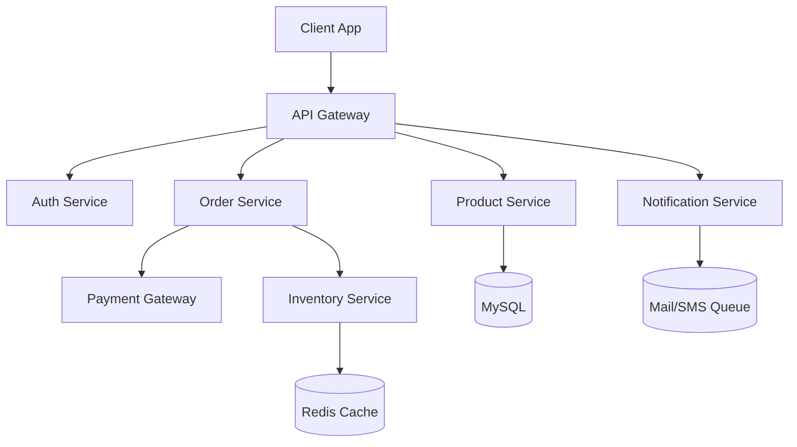
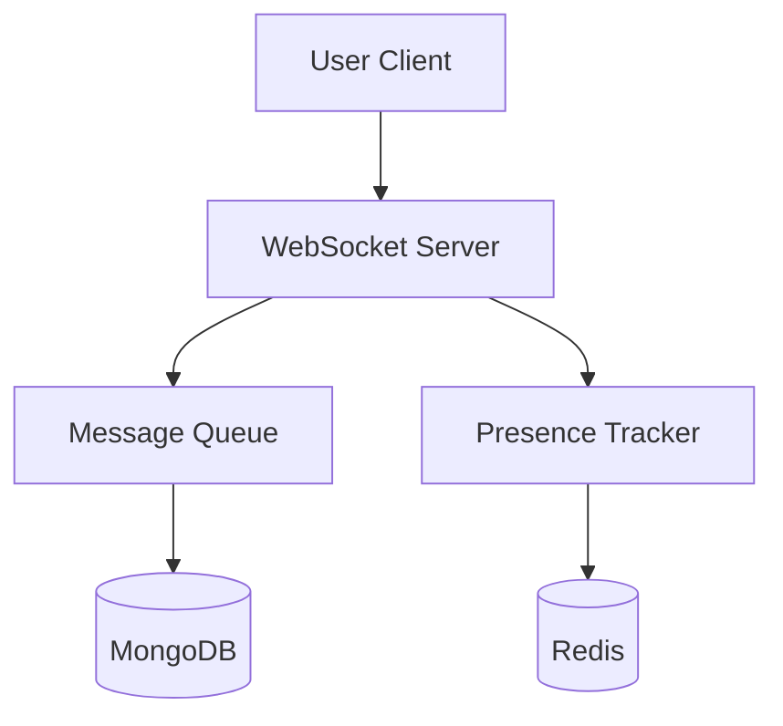
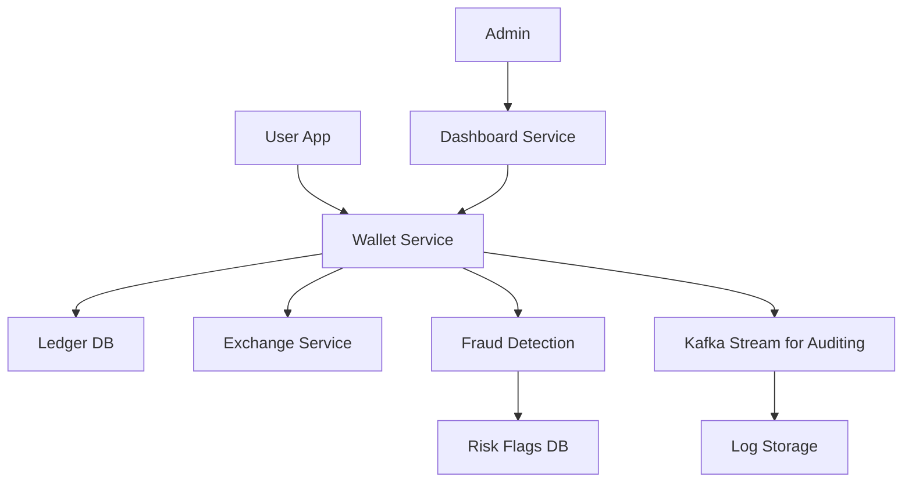

# 📐 System Designs

A collection of high-level system architecture notes and diagrams for real-world scalable applications.

---

## 🔹 E-Commerce Platform

**Components:**

- Web frontend (Next.js / Vue.js)
- Backend (Laravel REST API)
- Payment Gateway (Stripe/SSLCommerz)
- Product catalog service
- Order & inventory service
- Notification service (email/SMS)
- MySQL + Redis + S3 (AWS)



---

## 🔹 Real-Time Chat App

**Components:**

- Frontend (React / Vue + WebSocket)
- WebSocket server (Laravel Echo + Redis)
- User presence tracking
- Message delivery queues
- Typing indicator, read receipts
- MongoDB + Redis



---

## 🔹 Online Payment System

**Components:**

- User Wallet Service
- Transaction Ledger
- Fraud Detection Microservice
- Currency Exchange (optional)
- Admin Dashboard
- MySQL, Kafka, Redis, Cloud Logs



---

## 📌 Notes

- All designs support scalability via load balancers, queues, and stateless services.
- Use `Mermaid.js` for version-controlled architecture diagrams.
- Can export visuals from draw.io and include in `/diagrams` folder (optional).

---

## 📁 Folder Structure (suggested)

```
system-designs/
├── ecommerce.md
├── chat-app.md
├── payment-system.md
├── diagrams/
│   ├── ecommerce.drawio
│   ├── chat-app.drawio
│   └── payment-system.drawio
├── README.md
```

---

### 🔗 Download draw.io templates (raw XML structure):

- [ecommerce.drawio](sandbox:/mnt/data/system-designs/diagrams/ecommerce.drawio)
- [chat-app.drawio](sandbox:/mnt/data/system-designs/diagrams/chat-app.drawio)
- [payment-system.drawio](sandbox:/mnt/data/system-designs/diagrams/payment-system.drawio)

These can be imported into [draw.io](https://draw.io) for editing or exporting as PNG/SVG.
