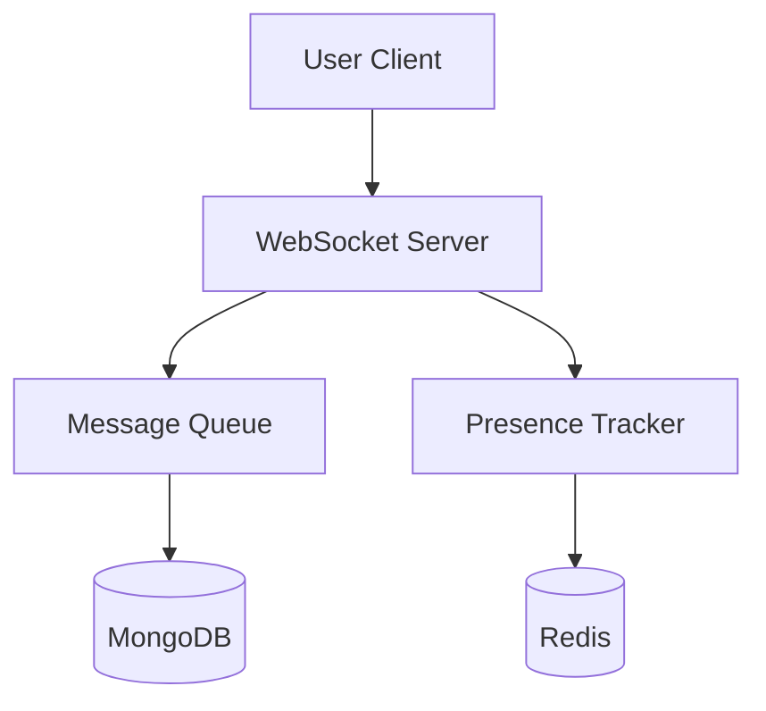

# 💬 Real-Time Chat App Design

## Components
- Frontend (React / Vue + WebSocket)
- WebSocket server (Laravel Echo + Redis)
- User presence tracking
- Message delivery queues
- Typing indicator, read receipts
- MongoDB + Redis

