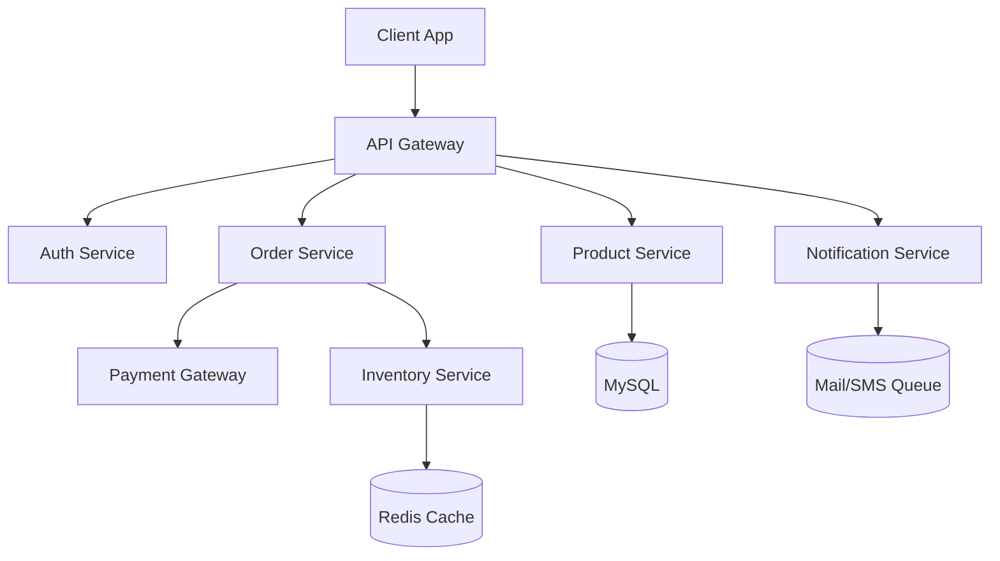

# 🛒 E-Commerce Platform System Design

## Components
- Web frontend (Next.js / Vue.js)
- Backend (Laravel REST API)
- Payment Gateway (Stripe/SSLCommerz)
- Product catalog service
- Order & inventory service
- Notification service (email/SMS)
- MySQL + Redis + S3 (AWS)

