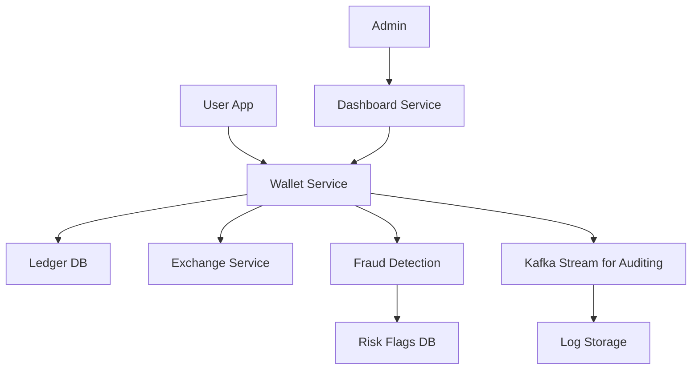

# 💸 Online Payment System Design

## Components
- User Wallet Service
- Transaction Ledger
- Fraud Detection Microservice
- Currency Exchange (optional)
- Admin Dashboard
- MySQL, Kafka, Redis, Cloud Logs

